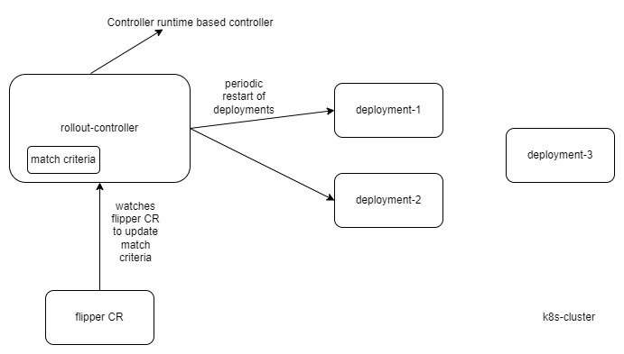

# Rollout controller

## Introduction
  The Rollout controller periodically restarts all the deployments in the cluster which match a certain criteria. The matching criteria can be changed by deploying an appropriate flipper CR in the cluster.

## Functional Requirements
- The rollout-controller periodically restarts all the deployment which match certain criteria.
- The Matching criteria specifies the namespaces and match labels. A deployment matches the criteria when
  - If it has atleast one label matching the match.labels in criteria. A empty labels matches all objects.
  - AND if its namespace matches with any one of the namespaces in the criteria. A empty list of namespaces matches all objects.
- By default, the matching criteria has match.labels "mesh":"true" and empty list of namespaces. And the default restart interval is 10 minutes.
- The Matching criteria and restart interval can be updated by applying a CR of type 'flipper'.
  - Flipper CR provides restart interval and match criteria labels and list of namespaces.

## Assumptions
- At a time only one flipper CR will be used to determine the configuration for controller. Controller does not give error when multiple flipper CRs are deployed, it will consider any one of the CR for updating configuration.

## Design and Implementation

- The Rollout controller is based on controller-runtime based controller and scaffolding code was generated using  [kubebuilder-quick-start](https://book.kubebuilder.io/quick-start).
- It primarily watches the Deployment objects in cluster and triggers rollout restart if they match the matching configuration.
- Rollout restart is done by updating the field `obj.Spec.Template.ObjectMeta.Annotations["kubectl.kubernetes.io/restartedAt"]` and setting a new timestamp. This causes deployment to trigger a rolling restart of all pods. This is similar to what `kubectl rollout restart deployment...` command does.
- Periodic restart:
  - Periodic restarts are done by Requeuing the Events back into work queue with RequeueAfter interval=restartInterval.
- Watch Flipper CR:
  - The Controller also watches any changes in the flipper CR and updates the matching configuration whenever a new and valid CR is applied to the cluster.
  - It also reverts back to default config when the flipper CR is deleted from cluster.
- Edge cases handled by controller are
  - Controller will be triggered for any change in the deployment, so it takes care to not restart a deployment which was already restarted within last restartInterval. 
  - Controller takes care of not triggering restart for deployment already in deleting state.

## Deployment
- The Controller is deployed as a deployment 'rollout-controller' in namespace 'rollout' with a service account 'controller-manager' to limit access to needed resources only.

## Testing
- [Unit tests](./pkg/rollout/controller_test.go) cover scenarios for error handling, requeue, matching criteria and some corner cases. It uses a fake client
- [Integration tests](./pkg/rollout/controller_integration_test.go) cover few e2e scenarios to ensure controller is performing watches on resources properly. It uses a fake k8s environment.
- Manual testing
  - configuration under [testdata](./testdata/) can be used for performing manual testing. The [Deploy](./Deploy.md) file goes in detail on how to build and deploy controller in a cluster.